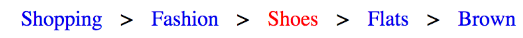

link to the lesson is below:

https://www.codecademy.com/journeys/full-stack-engineer/paths/fscj-22-web-development-foundations/tracks/fscj-22-improved-styling-with-css/modules/wdcp-22-learn-secondary-navigation-cd0549fb-731f-4d7a-ac10-11a0d8cf854f/lessons/ui-breadcrumb-nav/exercises/ui-breadcrumb-nav-where

# LEARN SECONDARY NAVIGATION

## Where am I?

> This provides a basic breadcrumb structure that will display like the image below:

> In the exercises, you will replicate this behavior for our travel website.
